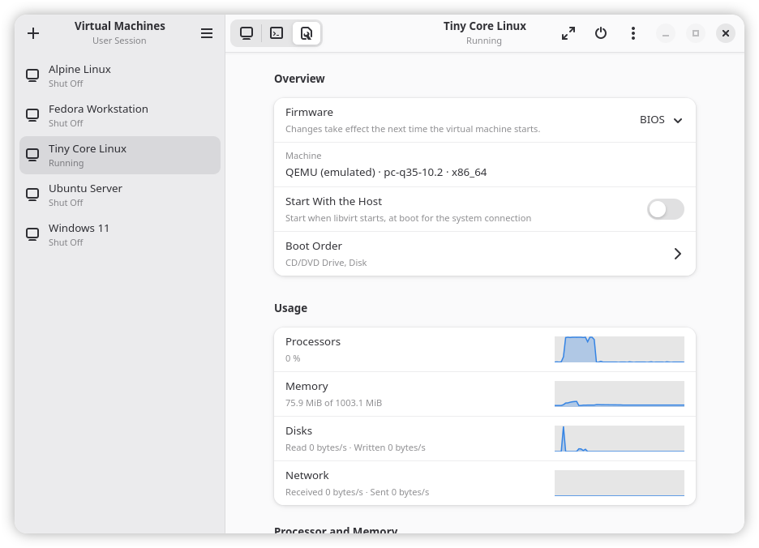

# Machines

  

Machines manages QEMU/KVM virtual machines through libvirt, written in Rust with GTK 4 and
libadwaita. It lists the machines of the system connection or of your user session,
starts, stops and pauses them, saves them to disk to resume later, shows their display in
a built-in VNC or SPICE console, creates new ones from an installation ISO or an existing
disk image, renames and clones them, copying their disks, takes snapshots of them to
revert to, and deletes them with their disks.

A machine's details page graphs what it uses of the host's processors, memory, disks and
network while it runs, and adds, removes and grows its disks, adds and removes CD/DVD
drives and network interfaces, gives it whole disks of the host, a TPM, sound card, random
number generator and folders shared over virtiofs, and passes USB and PCI devices of the
host through to it, or plugs USB devices into it while it runs. A USB device a running
machine has goes back to it when it is pulled out and plugged in again, as long as Machines
is open; libvirt alone leaves it to the host. It sets the processor
model (the host's own, for the fastest), how the processors are laid out in sockets, cores
and threads, which host processors they run on, huge pages for the memory, and the
firmware: BIOS, or UEFI with or without Secure Boot. It also picks the display protocol
and video card (virtio, QXL, VGA…), or none for a machine whose screen is a passed-through
graphics card's, turns on 3D acceleration, which renders on the host's GPU with a virtio
card, and sets the order the machine boots from its disks, drives, network interfaces and
passed-through devices in. What a running machine cannot take at once, such as a SATA
drive, it gets at its next start. Whatever the page has no row for can be changed in the
machine's XML definition, which libvirt checks before taking it. The main menu also
manages the connection's storage pools (directories, NFS shares, LVM volume groups and
iSCSI targets) with the volumes in them, which it creates, grows, deletes and uploads
files into, and its virtual networks: NAT, routed, isolated, or on a bridge of the host.

The console reaches a machine's display through libvirt rather than over the network, so
new machines have a display with no listening socket at all: SPICE where
QEMU has it, which carries sound and, with the SPICE agent in the guest, sizes the guest's
screen to the window and shares the clipboard's text with it; VNC otherwise. SPICE also
lends USB devices of the computer the console runs on to the machine, which works on
remote connections and the user session too. With 3D acceleration, SPICE hands the console
the GPU's frames as they are, while VNC has QEMU read them back. The display can also move
to a window of its own, to put it on another screen, and be saved as a screenshot. While
it has the keyboard, the console passes every key to the machine, Tab included; pressing
Ctrl+Alt together and letting go hands the keyboard back.

A third page shows the machine's serial console as text, for machines without a display
and for watching a guest boot; new machines have a serial port for it.

You need libvirt with its QEMU driver, gvnc (from gtk-vnc), spice-glib, VTE for GTK 4,
GTK 4.22 and libadwaita 1.9. With osinfo-db installed, as it is alongside virt-manager or
GNOME Boxes, Machines recognizes the system on an installation ISO and gives the new machine
the memory, disk and firmware that system recommends.

## Building and installing

On Fedora the build needs:

    sudo dnf install cargo blueprint-compiler gtk4-devel libadwaita-devel libvirt-devel \
        gvnc-devel spice-glib-devel libusb1-devel vte291-gtk4-devel

Then:

    just build
    sudo just install        # or: just prefix=$HOME/.local install

`just run` starts the debug build without installing it, and `just check` and `just test`
are what a change has to pass.

## Connections

The system connection (`qemu:///system`) is the one virt-manager uses, and the default. Its
machines run as the `qemu` user and can start with the host. Using it takes either
membership of the `libvirt` group or a polkit agent to ask for your password, which every
full desktop has. The user session (`qemu:///session`) needs neither: its machines run as
you, with QEMU's own user-mode networking in place of libvirt's virtual networks. The
main menu switches between the two.

Virtual networks, and passing PCI devices through, need the system connection. A PCI
device also needs the IOMMU turned on in the firmware and on the kernel command line
(`intel_iommu=on` on Intel), and the host goes without the device while the machine has it.

On the system connection, QEMU runs as `qemu` and has to be able to read the installation
ISO. One kept under your home folder usually cannot be read by it; put it in
`/var/lib/libvirt/images` or another place the `qemu` user can reach.

## License

GPL-3.0-or-later. Contact: sachesi <xsachesi@pm.me>.
