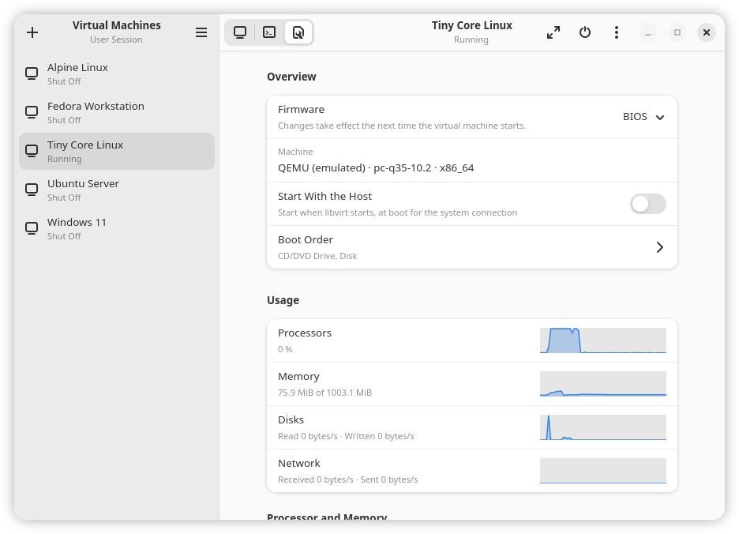

# Machines

  

Machines manages QEMU/KVM virtual machines through libvirt, written in Rust with GTK 4 and
libadwaita. It lists the machines of the system connection or of your user session,
starts, stops and pauses them, saves them to disk to resume later, shows their display in
a built-in VNC or SPICE console, creates new ones from an installation ISO or an existing
disk image, renames and clones them, copying their disks, takes snapshots of them to
revert to, and deletes them with their disks.

A machine's details page graphs what it uses of the host's processors, memory, disks and
network while it runs, and adds, removes and grows its disks, adds and removes CD/DVD
drives and network interfaces, gives it whole disks of the host, a TPM, sound card, random
number generator and folders shared over virtiofs, and passes USB and PCI devices of the
host through to it, or plugs USB devices into it while it runs. A USB device a running
machine has goes back to it when it is pulled out and plugged in again, as long as Machines
is open; libvirt alone leaves it to the host. It sets the processor
model (the host's own, for the fastest), how the processors are laid out in sockets, cores
and threads, which host processors they run on, huge pages for the memory, and the
firmware: BIOS, or UEFI with or without Secure Boot. It also picks the display protocol
and video card (virtio, QXL, VGA…), or none for a machine whose screen is a passed-through
graphics card's, turns on 3D acceleration, which renders on the host's GPU with a virtio
card, and sets the order the machine boots from its disks, drives, network interfaces and
passed-through devices in. What a running machine cannot take at once, such as a SATA
drive, it gets at its next start. Whatever the page has no row for can be changed in the
machine's XML definition, which libvirt checks before taking it. The main menu also
manages the connection's storage pools (directories, NFS shares, LVM volume groups and
iSCSI targets) with the volumes in them, which it creates, grows, deletes and uploads
files into, and its virtual networks: NAT, routed, isolated, or on a bridge of the host.

Advanced Settings, in the machine's menu, adds what few machines need to the page: the
version of the machine type, a boot menu, what happens when the guest powers off, reboots
or crashes, the clock in local time as Windows keeps it, Hyper-V enlightenments, host
processors for QEMU's emulator and disk I/O threads, and each disk's bus, cache, I/O mode
and discard, and each network card's model. On the system connection, whose QEMU may, it
also offers the host's own system information and locked memory, and edits the scripts libvirt runs as root before the machine
starts and after it stops, to set huge pages aside or hand a graphics card over, say. A
helper writes them through pkexec, so saving one asks for an administrator's password.

The console reaches a machine's display through libvirt, with no listening socket, over
SPICE where QEMU has it and VNC otherwise. SPICE carries sound, the clipboard's text, USB
devices of the computer Machines runs on, and, where a machine's display settings allow
it, the computer's microphone. The console can also show a passed-through graphics card's
screen through Looking Glass. A third page shows the machine's serial console as text.

## Installing

Each [release](https://github.com/sachesi/machines/releases) has packages for Fedora,
Debian, Ubuntu and Arch Linux, and the same release is in Copr (`sachesi/software`), on the
openSUSE Build Service (`home:sachesi:software`) and in the AUR (`machines`). To build from
source:

    just build
    sudo just install        # or: just prefix=$HOME/.local install

## Documentation

- [Installing](docs/installing.md): requirements, building, and what `install` puts where
- [Connections](docs/connections.md): the system connection, the user session, and others
- [The console](docs/console.md): VNC, SPICE, Looking Glass and the serial console
- [Start and stop scripts](docs/scripts.md): what Machines installs for them, and where
- [Metadata](docs/metadata.md): what Machines keeps in a machine's definition

## License

GPL-3.0-or-later. Contact: sachesi <xsachesi@pm.me>.

The Looking Glass console follows the protocols of
[Looking Glass](https://looking-glass.io), © The Looking Glass Authors, and of
[LGMP](https://github.com/gnif/LGMP), © Geoffrey McRae, both under GPL-2.0-or-later.
